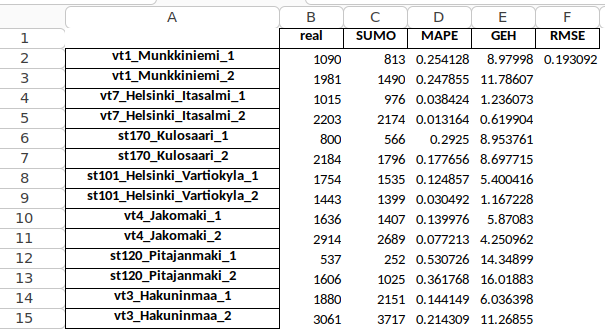

# User guide

This guide will describe structure of the repository and all steps in the pipeline that turns random routes into a simulation in the traffic simulator [SUMO](https://www.eclipse.org/sumo/) (Simulation of Urban MObility) and how to reduce that simulation to a smaller area using results from large simulation.

## Pre-generated demand data
If you just need the demand data for Helsinki area, navigate into `demo`. The strucutre of that directory is the following:
* `helsinki.net.xml` represents the network file containing the entire network for HKI area. This network was extracted from [OpenStreetMaps](https://www.openstreetmap.org/). 
* `demand_routes.rou.xml` contains routes for Helsinki area.
* `real_world_comparison.xlsx` compares simulated traffic counts to real-world traffic counts obtained from [Digitraffic](https://www.digitraffic.fi/en/road-traffic/#current-data-from-tms-stations).
* `sumo_launch.sumocfg` contains [SUMO config](https://sumo.dlr.de/docs/Other/File_Extensions.html) file that can be used to launch simulation.
* `smaller_areas` contains networks and routes for smaller areas of Helsinki each of them located around keskuspuisto. Area1 represents the smallest area, area2 is a bit bigger, and area3 is the largest.
    * `areaX_disconnected.net.xml`: these network files are the result of using `cutRoutes` while keeping all the edges in boundaries defined as a polygon. These network files might have disconnected parts.
    * `areaX_connected.net.xml`: these network files keep only the largest weakly-connected component of all the edges in the same boundaries. Note that these network files are not fully-connected, so it is not guaranteed that every combination of origin and destination is possible.

## Environment

During development the following core dependencies were used:

* SUMO 1.19.0
* Python 3.10.12
* sumolib, libsumo 1.18.0

> [!WARNING]  
> The code was developed and tested on Linux (Ubuntu 22.04.4) and most likely will not work on Windows

The `launch.json` file was kept, that contains configurations for Statistics, Geo Runner and Iterative Routesampler. More information about all of these steps can be found in the pipeline explanation section.

## Pipeline explanation

The pipeline works by taking network file for the area, and demand data in the form of traffic counts for arbitrary edges. The format of demand data can be seen in `calibration/data/edgedata_real.xml`.

You don't have to run the pipeline if you just want to get the demand data. For this, refer to pre-generated routes section of this documentation. However, you might use this repository to generate the demand data for a different network. For this, you'd need to do similar steps. If you do this, keep in mind that you would need to convert your demand data so that it has the same format as `calibration/data/edgedata_real.xml`. For this, you would need to figure out the mapping between the edge inside the network and the location of the detector used to collect traffic counts (i.e. traffic counting stations) 

The most important tool in this pipeline is `iterativeRoutesampler.py` from `tools` directory. The tool works by having multiple cycles, in each of which it calls [RouteSampler](https://sumo.dlr.de/docs/Tools/Turns.html) from SUMO toolkit to pick a subset of routes that tries to match the desired vehicle counts, followed by [DuaIterate](https://sumo.dlr.de/docs/Tools/Trip.html), to compute dynamic user equilibrium for that data. It then runs SUMO simulation to discover how closely simulated traffic counts match target counts, and removes the portion of routes that didn't make it to their traffic stations in time before simulation ended. It then calculates the difference between those two counts and runs RouteSampler to fill in that difference. The process is repeated a specified number of cycles.

### Ground truth data extraction
The traffic counts from traffic counting stations extracted from the API of [digitraffic](https://www.digitraffic.fi/en/road-traffic/) from autumn 2018 serve as the ground truth data with which we use to model the traffic inside SUMO. The locations of all the detectors that we used can be found on the [map for the AIForLEssAuto project](https://www.google.com/maps/d/viewer?mid=111A6COcjj4kDMDeImVg7X4D_rm_3of8&usp=sharing). The tools that were used for extracting the data can be found in `calibration/tools` and `calibration/tools/traffic_counts_retrieval_2018`.

### Generating random initial set of routes
First create the random routes using [RandomTrips](https://sumo.dlr.de/docs/Tools/Trip.html) tool from SUMO toolkit. If you're using this pipeline to create demand data for a different network, the random trips must be generated for that network.

The file `tools/randomTrips.py` contains a slightly modified version of the original randomTrips.py file from SUMO toolkit. It adds a few options that we considered useful to have when generating routes, such as fringe-via-edge-types which allows us to better control which of the edges would be considered as origin or destination. It is not mandatory to use this file to generate your random trips.

### Iterative Routesampler
Head into `tools/iterativeRoutesampler.py` and modify the variables under `main script parameters` and `paths to input files`. 

> [!WARNING]  
> If you're using `IterativeRoutesampler.py`, keep in mind that setting a large number for `DUA_STEPS` variable significantly increases the running time and the space on your hard drive. This is due to the use of [DuaIterate](https://sumo.dlr.de/docs/Tools/Trip.html) tool from SUMO toolkit, that computes the dynamic user equilibrium (DUA) for the vehicles in the simulation. It iteratively runs the simulation to discover travel times and then assigns alternative routes to some of the vehicles according to them. This improves the accuracy of the simulation at the cost of longer running time and disk usage. (Each cycle uses about 12.5 GB and takes 15 minutes for each duaiterate step individually)

### Running the final simulation
Use `tools/geoRunner.py` to produce the final simulation using demand data. You would need to modify variables pointing to SUMO config file, as well as `.add` file that contains the locations of traffic detectors inside the network. You can use `sumo_files/data/helsinki_all_detectors.add.xml` as an example.

### Statistics
After the simulation finishes, you can use `tools/statistics.py` to get the results of the simulation. For this, you would need data about target counts in the same format as `calibration/data/road_station_detections.json`. Alternatively, you could modify the script to work with the same format as `calibration/data/edgedata_real.xml`. The `statistics.py` script creates `calibration/data/real_world_comparison.xlsx` file that computes [MAPE](https://en.wikipedia.org/wiki/Mean_absolute_percentage_error), [GEH](https://en.wikipedia.org/wiki/GEH_statistic) and [RMSE](https://en.wikipedia.org/wiki/Root_mean_square_deviation) statistics between the simulated and target counts.

<!-- ## Changes that could improve the project
Rename the output file in `visumRouteGeneration.py` to "SUMO_OD_file.od". -->
