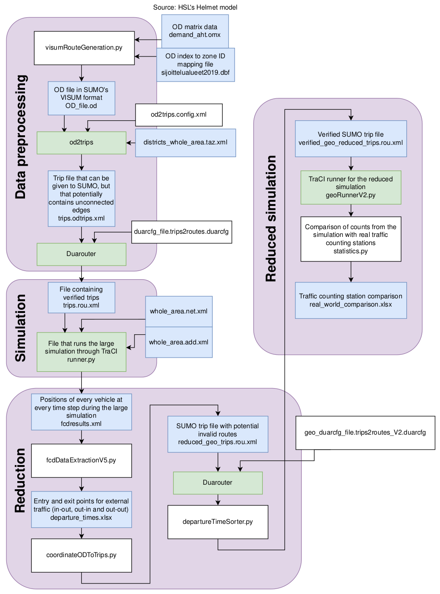
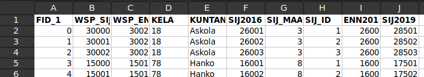
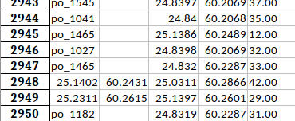

# User guide
This guide will describe all steps in the pipeline that turns an origin-destination (OD) matrix into a simulation in the traffic simulator [SUMO](https://www.eclipse.org/sumo/) (Simulation of Urban MObility) and how to reduce that simulation to a smaller area using the results from the large simulation.

## Pre-generated routes
The pre-generated route files, evaluation results, the .sumocfg file and all the dependencies to re-produce the data is in the `/demo` directory. You can use those files without running the whole pipeline.

## Pipeline usage
> [!WARNING]  
> Code was written on Linux and will most likely not work on Windows

I kept launch.json file in .vscode directory so you can look at how the code is supposed to be launched

More comprehensible guide to script parameters and updated documentation coming soon.

### Generating routes
If you want to run the whole pipeline all the way from OD and traffic data to SUMO route files, do the following steps:
1. navigate to WP4/sumo-hki-cm/tools and launch iterativeRoutesampler.py (you can tweak the parameters of the script there) or use the corresponding configuration in launch.json
2. if you specified the number of cycles, then you can find the generated `final.sumocfg.xml` that can be used to launch the simulation directly. if you didn't, you'll have to create the config file yourself using the routes from the latest iteration of sumo of the last cycle (will be called something like `sumo_c005_001_routes_fast.rou.xml`). You can also try adding the results from the next cycle, first iteration of routesampler. This sometimes improves the results. This is also what was done in the "demo" case.

> [!NOTE]  
> iterativeRoutesampler.py uses a lot of disk space and time because of duaiterate. (Each cycle uses about 12.5 GB and takes 15 minutes for each duaiterate step individually)

### Testing the simulation and comparing to real-world data
Real-world data is provided in the `calibration/data` directory. If you want to see the code that was used to extract real-world data, please contact the research group.

After you ran the iterativeRoutesampler.py and got the sumo config file:
1. launch geoRunner.py (GeoRunner preset in launch.json)
2. launch statistics.py (Statistics preset in launch.json) 

## Environment used

During development I used these core dependencies:

* SUMO 1.19.0
* Python 3.10.12
* sumolib, libsumo 1.18.0

## Pipeline explanation

> [!NOTE]  
> This section is WIP as there are changes to the pipeline since last update

The goal in this project was to create a realistic simulation of the traffic Helsinki. While no OD data was available specifically for Helsinki, the public transport company HSL had created a demand model for a larger area. While this data can be used as is to simulate the larger area, the time needed to run a one hour instance is much longer (around 6.5 hours instead of 10 minutes). However, to create a reduced OD matrix one needs to know when and where external traffic enters and exits Helsinki. By external traffic we mean vehicles that have their origin in Helsinki and destination outstide Helsinki (in-out), origin outside Helsinki and destination inside Helsinki (out-in) and origin and destination outside Helsinki, but enter Helsinki at some point (out-out). To create such a reduced matrix a simulation of the large area was first run, after which a reduction process was run to make a reduced simulation of Helsinki possible. This GitHub repository contains the code used for this reduction process.

The pipeline can be run with the file `completePipeline.sh` in the root directory.

### Step 1: Data processing 

`visumRouteGeneration.py`
To run this file the user needs to have a dBase database file (.dbf) containing the zones in the `data` directory. This file is used for pairing zone indices in the OD matrix with their actual number. Only the columns `FID_1` and `SIJ2019` are used in this step. The image below is a screenshot of the data in HSL's database file.

The output is an OD file in [O-format (VISUM/VISSIM)](https://sumo.dlr.de/docs/Demand/Importing_O/D_Matrices.html#the_o-format_visumvissim). SUMO's built-in tool  os2trips takes the generated OD file and writes trips by picking random edges from the TAZs (zones) that the trips have as origin or destination. Since the network may contain edges that are disconnected from the rest of the edges these trips are potentially invalid and need to be checked to avoid errors during the simulation.

SUMO's built-in tool Duarouter is used for verifying these trips. The extra keywork `--write-trips true` is used when Duarouter is started to write trips instead of routes (complete path consisting of all edges between the origin and destination).

`randomDepartureTimes.py`, `departureTimeSorter.py` and `indexZeroToN.py` (not included in the image describing the pipeline) do just what the names suggest. Since the only definition of the departures of the vehicles in HSL's OD data was that the depart sometime during the one hour period, the vehicles are given a random departure time from 0 to 3600 using `randomDepartureTimes.py`. `departureTimeSorter.py` is used to sort the trips by departure time since all trips need to be sorted when the simulation starts. Finally, `indexZeroToN.py` gives the trips indices from 0 to n, where n is the number of trips. This step is necessary because `fcdDataExtraction.py` (used later) assumes that an array with the length of n can be created to store origins and destinations of the vehicles.

### Step 2: Running the large simulation: `runner.py`
`runner.py` launches an instance of the large simulation defined in `1_hour_whole_area.sumocfg` using [TraCI](https://sumo.dlr.de/docs/TraCI.html). The position of every vehicle at every time step is saved to the file `fcdresults.xml`.

### Step 3: Reduction of the large simulation
In this step a reduced OD matrix is created for in-out, out-in and out-out vehicles with `fcdDataAnalysisV5.py`. The vehicle positions in `fcdresults.xml` are used to determine when and where vehicles enter and exit Helsinki (or any chosen smaller area in the large simulation). The output is an Excel file called `departure_times_V5.xlsx`, with each row representing a vehicle. The origin, destination and departure time is included. If a vehicle's origin or destination is in Helsinki, it is saved as a TAZ id and otherwise it is represented as coordinates.

\
*An example of the output of fcdDataExtractionV5*

After `fcdDataAnalysisV5.py` has been run `departure_times_V5.xlsx` is used to generate a new trip file for the simulation of the smaller area, which in this case Helsinki. `coordinateODToTripsV2.py` generates the trip file using `departure_times_V5.xlsx` for the external traffic and the original OD matrix for in-in traffic. After that the same preparation process is run as before the large simulation.

### Step 4: Running the reduced simulation
As a last step the reduced simulation is launched through TraCI in `geoRunnerV2.py`. After that `statistics.py` is run to create a file where real world traffic counts are compared to the corresponding points in the simulation (implemented using induction loops in SUMO).

<!-- ## Changes that could improve the project
Rename the output file in `visumRouteGeneration.py` to "SUMO_OD_file.od". -->
